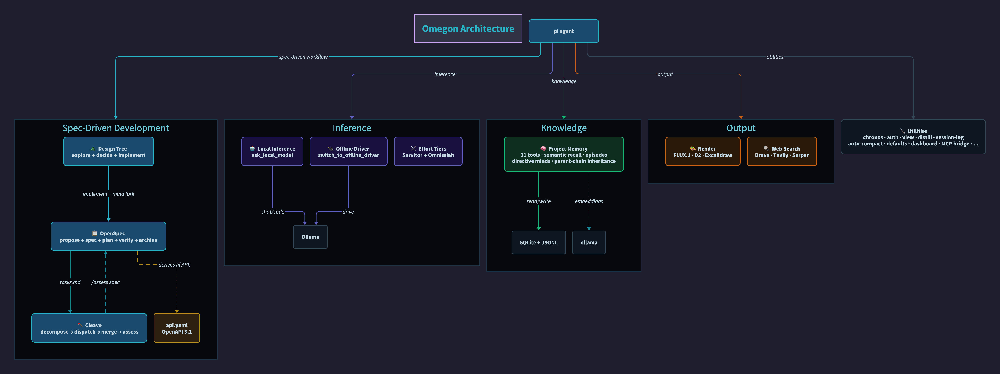
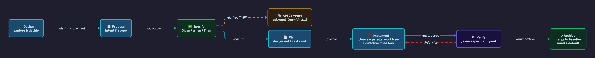
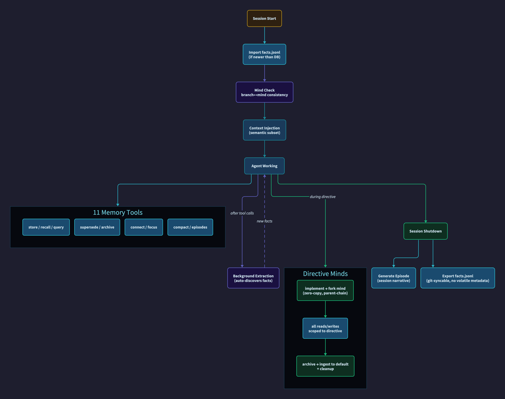

# Omegon

An opinionated distribution of [**pi**](https://github.com/badlogic/pi) — the coding agent by [Mario Zechner](https://github.com/badlogic). Omegon bundles pi core with extensions for persistent project memory, spec-driven development, local LLM inference, image generation, web search, parallel task decomposition, a live dashboard, and quality-of-life tools.

> **Relationship to pi:** Omegon is not a fork or replacement. It packages pi as a dependency and layers extensions on top. All credit for the pi coding agent goes to Mario Zechner and the pi contributors. The core pi packages (`@cwilson613/pi-coding-agent`) track [upstream `badlogic/pi-mono`](https://github.com/badlogic/pi-mono) daily, adding targeted fixes for OAuth login reliability and bracketed-paste input handling. If you want standalone pi without Omegon's extensions, install `@mariozechner/pi-coding-agent` directly.

## Installation

```bash
npm install -g omegon
```

This installs the `pi` command globally. If a standalone pi package is already installed, omegon will transparently replace it (the same `pi` command, with extensions included). To switch back to standalone pi at any time:

```bash
npm uninstall -g omegon
npm install -g @mariozechner/pi-coding-agent
```

**First-time setup:**

```bash
pi          # start pi in any project directory
/bootstrap  # check deps, install missing tools, configure preferences
```

### Keeping up to date

| Context | How |
|--------|-----|
| **Installed Omegon (`npm install -g omegon`)** | Run `/update` from inside pi. Omegon installs the latest package, verifies the active `pi` command still resolves to Omegon, clears caches, then asks you to restart. |
| **Dev checkout / contributor workflow** | Run `/update` or `./scripts/install-pi.sh`. Both follow the same lifecycle contract: pull/sync, build, refresh dependencies, `npm link --force`, verify the active `pi` target, then stop at an explicit restart handoff. |
| **Lightweight cache refresh only** | Run `/refresh`. This clears transient caches and reloads extensions, but it is not equivalent to package/runtime replacement. |

> The patched fork syncs from upstream daily via GitHub Actions. Bug fixes and new AI provider support land automatically. If a sync PR has conflicts, they are surfaced for manual review before merging — upstream changes are never silently dropped.

> **Note:** `/update` is the authoritative Omegon update path. It intentionally ends at a verified restart boundary rather than hot-swapping the running process after package/runtime mutation.

## Architecture



Omegon extends `@cwilson613/pi-coding-agent` with **27 extensions**, **12 skills**, and **4 prompt templates** — loaded automatically on session start.

### Development Methodology

Omegon enforces **spec-first development** for non-trivial changes:



The full lifecycle: **design → propose → spec → plan → implement → verify → archive**. Given/When/Then scenarios are the source of truth for correctness — code implements the specs, not the reverse.

## Extensions

### 📋 OpenSpec

Spec-driven development lifecycle — proposal → specs → design → tasks workflow with delta-spec merge on archive.

- **Tool**: `openspec_manage`
- **Commands**: `/opsx:propose`, `/opsx:spec`, `/opsx:ff`, `/opsx:status`, `/opsx:verify`, `/opsx:archive`, `/opsx:sync`
- **Lifecycle stages**: proposed → specified → planned → implementing → verifying → archived
- **API contracts**: When a change involves a network API, derives an OpenAPI 3.1 spec from Given/When/Then scenarios; `/assess spec` validates implementation against it
- Integrates with [OpenSpec CLI](https://github.com/Fission-AI/OpenSpec) profiles

### 🪓 Cleave

Parallel task decomposition with dependency-ordered wave dispatch in isolated git worktrees.

- **Tools**: `cleave_assess` (complexity evaluation), `cleave_run` (parallel dispatch)
- **Commands**: `/cleave <directive>`, `/assess cleave`, `/assess diff`, `/assess spec`
- **OpenSpec integration**: Uses `tasks.md` as the split plan when `openspec/` exists, enriches child tasks with design decisions and spec acceptance criteria, reconciles task completion on merge, guides through verify → archive
- **Skill-aware dispatch**: Auto-matches skill files to children based on file scope patterns (e.g. `*.py` → python, `Containerfile` → oci). Annotations (`<!-- skills: python, k8s -->`) override auto-matching
- **Model tier routing**: Each child resolves an execution tier — explicit annotation > skill-based hint > default. Provider-neutral tier labels resolve to concrete models through the session routing policy
- **Adversarial review loop** (opt-in via `review: true`): After each child completes, an opus-tier reviewer checks for bugs, security issues, and spec compliance. Severity-gated: nits→accept, warnings→1 fix iteration, criticals→2 fixes then escalate, security→immediate escalate. Churn detection bails when >50% of issues reappear between rounds
- **Large-run preflight**: Asks which provider to favor before expensive dispatches, preventing mid-run subscription exhaustion

### 🌲 Design Tree

Structured design exploration with persistent markdown documents — the upstream of OpenSpec.

- **Tools**: `design_tree` (query), `design_tree_update` (create/mutate nodes)
- **Commands**: `/design list`, `/design new`, `/design update`, `/design branch`, `/design decide`, `/design implement`
- **Document structure**: Frontmatter (status, tags, dependencies, priority, issue_type, open questions) + sections (Overview, Research, Decisions, Open Questions, Implementation Notes)
- **Work triage**: `design_tree(action="ready")` returns all decided, dependency-resolved nodes sorted by priority — the session-start "what next?" query
- **Blocked audit**: `design_tree(action="blocked")` returns all stalled nodes with each blocking dependency's id, title, and status
- **Priority**: `set_priority` (1 = critical → 5 = trivial) on any node; `ready` auto-sorts by it
- **Issue types**: `set_issue_type` classifies nodes as `epic | feature | task | bug | chore` — bugs and chores are now first-class tracked work
- **OpenSpec bridge**: `design_tree_update` with `action: "implement"` scaffolds `openspec/changes/<node-id>/` from a decided node's content; `/cleave` executes it
- **Full pipeline**: design → decide → implement → `/cleave` → `/assess spec` → archive

### 🧠 Project Memory

Persistent, cross-session knowledge stored in SQLite. Accumulates architectural decisions, constraints, patterns, and known issues — retrieved semantically each session.

- **11 tools**: `memory_store`, `memory_recall`, `memory_query`, `memory_supersede`, `memory_archive`, `memory_connect`, `memory_compact`, `memory_episodes`, `memory_focus`, `memory_release`, `memory_search_archive`
- **Semantic retrieval**: Embedding-based search via Ollama (`qwen3-embedding`), falls back to FTS5 keyword search
- **Background extraction**: Auto-discovers facts from tool output without interrupting work
- **Episodic memory**: Generates session narratives at shutdown for "what happened last time" context
- **Global knowledge base**: Cross-project facts at `~/.pi/memory/global.db`
- **Git sync**: Exports to JSONL for version-controlled knowledge sharing across machines



### 📊 Dashboard

Live status panel showing design tree, OpenSpec changes, cleave dispatch, and git branches at a glance.

- **Commands**: `/dash` (toggle compact ↔ raised), `/dashboard` (open side panel)
- **Compact mode**: Single footer line — design/openspec/cleave summaries + context gauge
- **Raised mode**: Full-width expanded view (toggle with `/dash`)
  - Git branch tree rooted at repo name, annotated with linked design nodes
  - Two-column split at ≥120 terminal columns: design tree + cleave left, OpenSpec right
  - Context gauge · model · thinking level in shared footer zone
  - No line cap — renders as much content as needed
- **Keyboard**: `Ctrl+Shift+B` toggles raised/compact

### 🌐 Web UI

Localhost-only, read-only HTTP dashboard that exposes live control-plane state as JSON. It binds to `127.0.0.1`, is not started automatically, and serves no mutation endpoints in the MVP.

- **Command**: `/web-ui [start|stop|status|open]`
- **Shell**: polling-first HTML dashboard
- **Endpoints**: `GET /api/state`, plus slice routes `/api/session`, `/api/dashboard`, `/api/design-tree`, `/api/openspec`, `/api/cleave`, `/api/models`, `/api/memory`, `/api/health`
- **State contract**: versioned `ControlPlaneState` (schema v1)

### ⚔️ Effort Tiers

Single global knob controlling the inference intensity across the entire harness. Seven named tiers using provider-neutral labels — tier labels resolve to concrete model IDs from whichever provider (Anthropic or OpenAI) the session routing policy prefers.

| Tier | Name | Driver | Thinking | Review |
|------|------|--------|----------|--------|
| 1 | **Servitor** | local | off | local |
| 2 | **Average** | local | minimal | local |
| 3 | **Substantial** | sonnet | low | sonnet |
| 4 | **Ruthless** | sonnet | medium | sonnet |
| 5 | **Lethal** | sonnet | high | opus |
| 6 | **Absolute** | opus | high | opus |
| 7 | **Omnissiah** | opus | high | opus |

- `/effort <name>` — switch tier mid-session
- `/effort cap` — lock current tier as ceiling; agent cannot self-upgrade past it
- `/effort uncap` — remove ceiling lock
- Affects: driver model, thinking level, extraction, compaction, cleave child floor, review model

### 🤖 Local Inference

Delegate sub-tasks to locally running LLMs via Ollama — zero API cost.

- **Tools**: `ask_local_model`, `list_local_models`
- **Commands**: `/local-models`, `/local-status`
- Auto-discovers available models on session start

### 🔌 Offline Driver

Switch the driving model from cloud to a local Ollama model when connectivity drops or for fully offline operation.

- **Tool**: `switch_to_offline_driver`
- Auto-selects best available model from a hardware-aware preference list
- Model registry in `extensions/lib/local-models.ts` — one file to update when new models land
- Covers: 64GB (70B), 32GB (32B), 24GB (14B/MoE-30B), 16GB (8B), 8GB (4B)

### 💰 Model Budget

Switch model tiers to match task complexity and conserve API spend. Tier labels are provider-neutral — resolved at runtime through the session routing policy.

- **Tool**: `set_model_tier` — `opus` / `sonnet` / `haiku` / `local`
- **Tool**: `set_thinking_level` — `off` / `minimal` / `low` / `medium` / `high`
- Downgrade for routine edits, upgrade for architecture decisions
- Respects effort tier cap — cannot upgrade past a locked ceiling

### 🎨 Render

Generate images and diagrams directly in the terminal.

- **FLUX.1 image generation** via MLX on Apple Silicon — `generate_image_local`
- **D2 diagrams** rendered inline — `render_diagram`
- **Native SVG/PNG diagrams** for canonical motifs (pipeline, fanout, panel-split) — `render_native_diagram`
- **Excalidraw** JSON-to-PNG rendering — `render_excalidraw`

### 🔍 Web Search

Multi-provider web search with deduplication.

- **Tool**: `web_search`
- **Providers**: Brave, Tavily, Serper (Google)
- **Modes**: `quick` (single provider, fastest), `deep` (more results), `compare` (all providers, best for research)

### 🗂️ Tool Profiles

Enable or disable tools and switch named profiles to keep the context window lean.

- **Tool**: `manage_tools`
- **Command**: `/profile [name|reset]`
- Pre-built profiles for common workflows; per-tool enable/disable for fine-grained control

### 📖 Vault

Markdown viewport for project documentation — serves docs with wikilink navigation and graph view.

- **Command**: `/vault`

### 🔐 Secrets

Resolve secrets from environment variables, shell commands, or system keychains — without storing values in config.

- Declarative `@secret` annotations in extension headers
- Sources: `env:`, `cmd:`, `keychain:`

### 🌐 MCP Bridge

Connect external MCP (Model Context Protocol) servers as native pi tools.

- Bridges MCP tool schemas into pi's tool registry
- Stdio transport for local MCP servers

### 🔧 Utilities

| Extension | Description |
|-----------|-------------|
| `bootstrap` | First-time setup — check/install dependencies, capture operator preferences (`/bootstrap`, `/refresh`, `/update-pi`) |
| `chronos` | Authoritative date/time from system clock — eliminates AI date math errors |
| `01-auth` | Auth status, diagnosis, and refresh across git, GitHub, GitLab, AWS, k8s, OCI (`/auth`, `/whoami`) |
| `view` | Inline file viewer — images, PDFs, docs, syntax-highlighted code |
| `distill` | Context distillation for session handoff (`/distill`) |
| `session-log` | Append-only structured session tracking |
| `auto-compact` | Context pressure monitoring with automatic compaction |
| `defaults` | Deploys `AGENTS.md` and theme on first install; content-hash guard prevents overwriting customizations |
| `terminal-title` | Dynamic tab titles showing active cleave runs and git branch |
| `spinner-verbs` | Warhammer 40K-themed loading messages |
| `style` | Alpharius design system reference (`/style`) |
| `version-check` | Polls GitHub releases hourly, notifies when a new Omegon release is available |
| `web-ui` | Localhost-only read-only HTTP dashboard and JSON control-plane endpoints (`/web-ui [start|stop|status|open]`) |

## Skills

Skills provide specialized instructions the agent loads on-demand when a task matches.

| Skill | Description |
|-------|-------------|
| `openspec` | OpenSpec lifecycle — writing specs, deriving API contracts, generating tasks, verifying implementations |
| `cleave` | Task decomposition, code assessment, OpenSpec lifecycle integration |
| `git` | Conventional commits, semantic versioning, branch naming, changelogs |
| `oci` | Container and artifact best practices — Containerfile authoring, multi-arch builds, registry auth |
| `python` | Project setup (src/ layout, pyproject.toml), pytest, ruff, mypy, packaging, venv |
| `rust` | Cargo, clippy, rustfmt, Zellij WASM plugin development |
| `typescript` | Strict typing, async patterns, error handling, node:test conventions for Omegon |
| `pi-extensions` | pi extension API — `registerCommand`, `registerTool`, event handlers, TUI context, common pitfalls |
| `pi-tui` | TUI component patterns — `Component` interface, overlays, keyboard handling, theming, footer/widget APIs |
| `security` | Input escaping, injection prevention, path traversal, process safety, secrets management |
| `style` | Alpharius color system, typography, spacing — shared across TUI, D2 diagrams, and generated images |
| `vault` | Obsidian-compatible markdown conventions — wikilinks, frontmatter, vault-friendly file organization |

## Prompt Templates

Pre-built prompts for common workflows:

| Template | Description |
|----------|-------------|
| `new-repo` | Scaffold a new repository with conventions |
| `init` | First-session environment check — orient to a new project directory |
| `status` | Session orientation — load project state and show what's active |
| `oci-login` | OCI registry authentication |

## Requirements

**Required:**
- `@cwilson613/pi-coding-agent` ≥ 0.57 — patched fork of [badlogic/pi-mono](https://github.com/badlogic/pi-mono). Install via `npm install -g @cwilson613/pi-coding-agent`. Fork source: [cwilson613/pi-mono](https://github.com/cwilson613/pi-mono)

**Optional (installed by `/bootstrap`):**
- [Ollama](https://ollama.ai) — local inference, offline mode, semantic memory search
- [d2](https://d2lang.com) — diagram rendering
- [mflux](https://github.com/filipstrand/mflux) — FLUX.1 image generation on Apple Silicon
- API keys for web search (Brave, Tavily, or Serper)

Run `/bootstrap` after install to check dependencies and configure preferences.

## Why a Patched Fork?

Upstream [`badlogic/pi-mono`](https://github.com/badlogic/pi-mono) is the canonical pi coding agent. Omegon depends on a fork rather than the upstream package for two reasons:

1. **OAuth login reliability** — upstream had no fetch timeout on OAuth token exchange calls. A slow or unreachable endpoint would hang the login UI indefinitely with no recovery path. Fixed in [`packages/ai/src/utils/oauth/`](https://github.com/cwilson613/pi-mono/tree/main/packages/ai/src/utils/oauth).

2. **Bracketed-paste stuck state** — a missing end-marker (e.g. from a large paste that split across chunks) would leave `isInPaste = true` permanently, silently swallowing all subsequent keystrokes including Enter. Fixed with a 500ms watchdog timer and Escape-to-clear in [`packages/tui/src/components/input.ts`](https://github.com/cwilson613/pi-mono/blob/main/packages/tui/src/components/input.ts).

Both fixes are submitted as PRs to upstream ([#2060](https://github.com/badlogic/pi-mono/pull/2060), [#2061](https://github.com/badlogic/pi-mono/pull/2061)). Once merged, the fork becomes a pass-through and the dependency can revert to `@mariozechner/pi-coding-agent`.

## License

ISC
